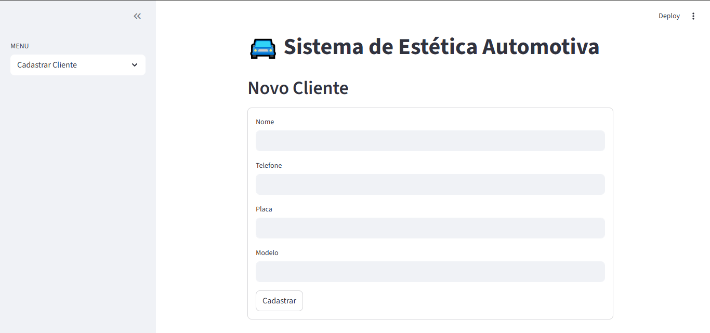
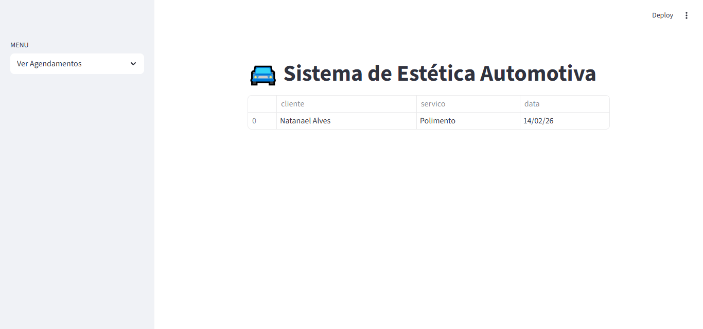

# 🚘 Sistema de Estética Automotiva

Aplicação web desenvolvida com **Python + Streamlit** para gerenciar clientes e agendamentos de serviços de estética automotiva.

## ✨ Funcionalidades

✅ Cadastro de clientes  
✅ Listagem de clientes  
✅ Agendamento de serviços  
✅ Visualização de agendamentos  
✅ Validação de dados  
✅ Interface web com Streamlit  

---

## 📸 Prints do sistema

### Cadastro


### Agendamento


### Listar Cliente


### Ver Agendamento


---

## 🎥 Demonstração


---

## 🚀 Como executar o projeto

```bash
pip install -r requirements.txt
streamlit run app.py

🛠 Tecnologias

Python

Streamlit

Git/GitHub


👨‍💻 Autor

Natanael Alves