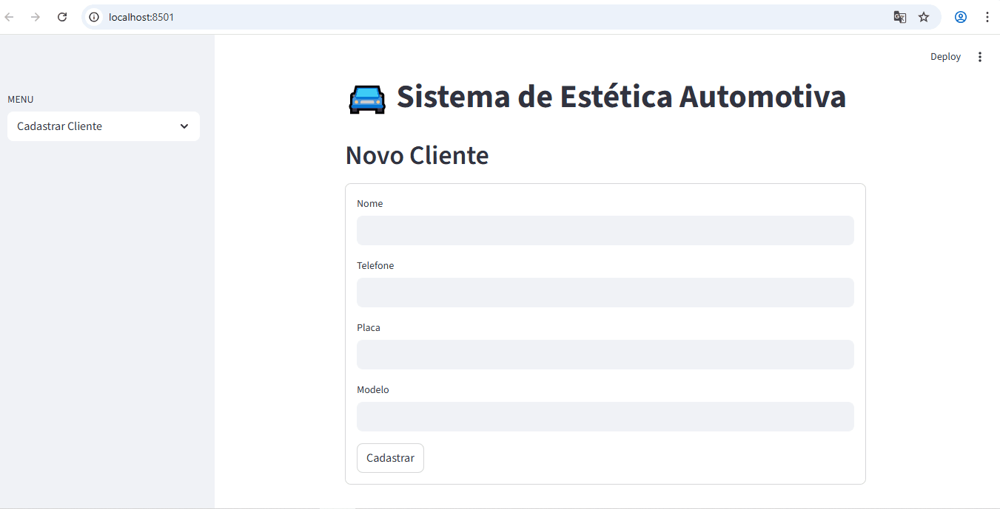
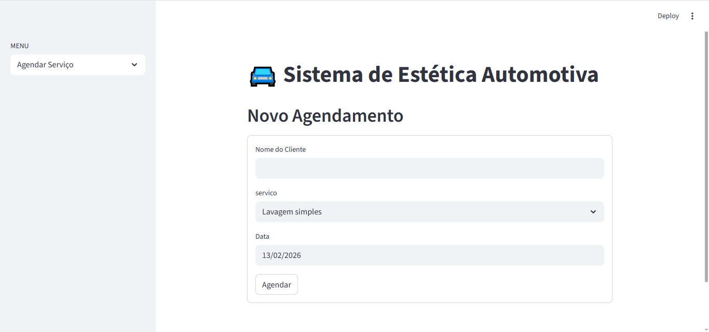
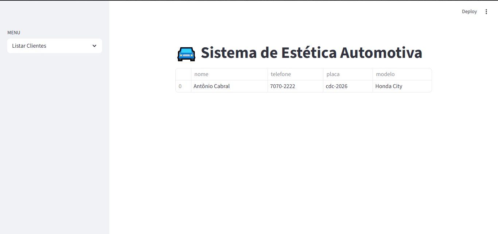

# 🚘 Sistema de Estética Automotiva

Aplicação web para gerenciamento de clientes e agendamentos de uma estética automotiva, permitindo cadastro, controle e visualização de serviços de forma simples e rápida.


## ✨ Funcionalidades

✅ Cadastro de clientes  
✅ Listagem de clientes  
✅ Agendamento de serviços  
✅ Visualização de agendamentos  
✅ Validação de dados  
✅ Interface web com Streamlit  

---

## 🎥 Demonstração




---

## 📸 Prints do sistema

### Cadastro


### Agendamento


### Listar Cliente


### Ver Agendamento


---

## 🚀 Como executar o projeto

```bash
pip install -r requirements.txt
streamlit run app.py

```
---

## 📂 Estrutura

```text
estetica-automotiva-streamlit/
│
├── app.py
├── funcoes.py
├── requirements.txt
├── images/
│   ├── cadastro.png
│   ├── demo.gif
└── README.md
```

---

## 🛠 Tecnologias

- ✅ Python
- ✅ Streamlit
- ✅ Git
- ✅ GitHub

---

## 👨‍💻 Autor

**Natanael Alves**  
Desenvolvedor Python Back-end

🔗 [LinkedIn](http://www.linkedin.com/in/natanaelalves)    
💻 [GitHub](https://github.com/natanael-alves)